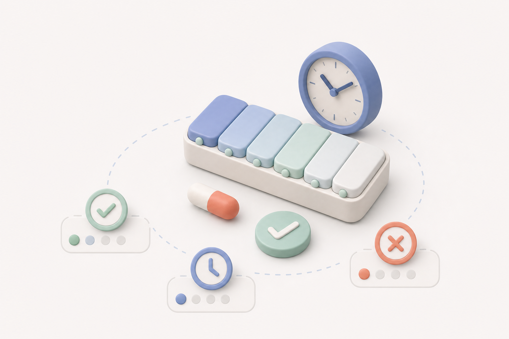
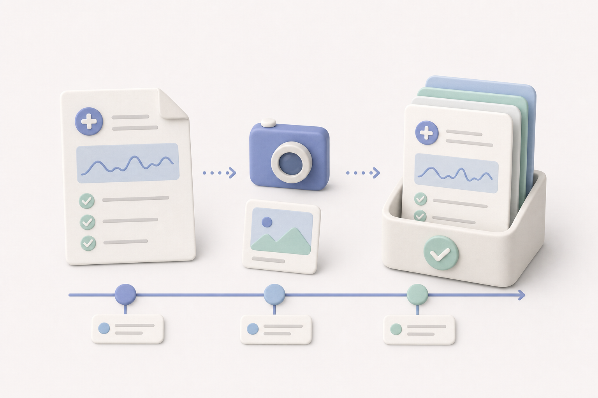

# Healther · 本地优先的健康管理助手

Healther 是一个面向长期用药、定期复查和慢性病管理场景的开源健康工具。

它希望解决的不是“替用户看病”，而是几件经常被忽略的小事：按时处理用药提醒、把散落的报告整理好、复诊前想起近期发生了什么，以及用更容易理解的方式阅读可靠的健康信息。

> Healther 只提供记录、提醒和通用健康信息，不进行诊断，不审核处方，也不会要求用户根据 APP 自行停药、换药或调整剂量。


## 为什么做这个项目

长期管理健康状况时，真正让人疲惫的往往不是某一个按钮，而是一连串很琐碎的事情：

- 今天的药是否已经服用；
- 下一次什么时候复查、需要带哪些资料；
- 报告散落在医院公众号、相册和纸质文件里；
- 见到医生后，说不清近期的身体变化和用药变化；
- 反复在网上搜索，反而被缺少背景的严重病例增加焦虑。

Healther 采用克制的产品思路：先把提醒、记录、整理和理解做好，不制造额外的健康焦虑。

## 简单使用说明

### 1. 今日用药



所有药物按照时间排列。处理一项提醒时，可以选择：

- **已服**：确认本次已经服用；
- **稍后**：按照自己设置的时间再次提醒；
- **跳过**：记录本次没有服用，不会伪装成“已完成”。

每种药都能单独设置服用时间、提醒间隔、提醒次数、剂量、备注和药物类别。APP 只记录用户的选择；不确定漏服后是否需要补服时，应联系医生或药师。

### 2. 健康档案



健康档案使用统一时间线保存：

- 就诊记录和医生意见；
- 检查、化验及报告图片；
- 用药变化；
- 下次复查计划。

报告可以直接拍照，也可以从相册选择，并按报告日期归档。点击时间线中的记录，可以进入详情查看当时填写的内容和原始报告。

“就诊后整理”会通过分步表单记录就诊信息、医生意见、诊断变化、用药变化和复查安排，而不是让用户只打一个完成勾。

### 3. 饮食助手


选择当前餐次和食物类别后，可以查看常见食物的通用建议：

- **更适合**：可以作为日常搭配的一部分；
- **注意份量**：不是不能吃，重点是一次吃多少；
- **谨慎选择**：降低频率，并优先考虑替代食物。

每个食物条目会解释建议份量、判断理由和替代选择。饮食助手采用保守的通用筛选，不根据单次化验结果生成个人营养处方。

### 4. 安心科普


安心科普不提供开放搜索和无限资讯流，只展示经过来源核对的患者资料。每篇内容会尽量用大白话说明：

- 一句话结论；
- 这件事是什么意思；
- 对现在的安排有什么影响；
- 下次可以问医生什么。

文章保留发布机构、原始链接和审核日期。研究进展只作为与医生沟通的背景，不会直接触发停药、换药或剂量调整。

### 5. 我的与本地数据

“我的”用于管理基础疾病、手术史、过敏情况、常用医院、医生和紧急联系人，也可以生成带密码的本地加密备份。

个人健康资料默认只保存在当前设备中。饮食和科普内容更新只下载公开内容，不上传用药、报告或个人资料。

## 已实现功能

- React + TypeScript + Capacitor Android 应用；
- 每种药独立设置提醒时间、间隔、次数和稍后提醒时长；
- Android 本地通知以及“已服 / 稍后 / 跳过”处理闭环；
- SQLite 本地保存药物、处理记录、健康档案和个人资料；
- 就诊后五步整理及复查提醒；
- 报告拍照、相册导入、压缩、本地归档和详情查看；
- 加密备份、恢复和换机迁移；
- 24 个离线食物条目和保守饮食筛选；
- 8 篇经过来源核对的离线科普；
- GitHub 静态内容更新，不重新安装 APK 也能更新饮食和科普；
- 更新数据格式校验、离线回退和上一版本保留。

完整开发状态见 [移动端说明](mobile-app/README.md)，信息架构和产品决策见 [DESIGN.md](DESIGN.md)，内容来源规范见 [DATA_SOURCES.md](DATA_SOURCES.md)。

## 内容更新机制

饮食和科普采用“安装包内置内容 + 已审核远程内容”的双层结构：

```text
权威公开来源
    ↓
采集、整理和翻译草稿
    ↓
人工审核
    ↓
GitHub Actions 校验并发布 JSON
    ↓
APP 下载、校验并保存到本机
```

APP 每天最多自动检查一次，也可以在“我的 → 饮食与科普内容更新”中手动检查。网络异常或内容校验失败时，继续使用上一个有效版本。

采集脚本和翻译工具只能生成草稿，不能绕过人工审核直接发布医学内容。

## 隐私与安全边界

- 无需注册账号；
- 个人健康资料默认仅保存在本机；
- Android 系统云备份已关闭；
- 备份文件使用用户设置的密码加密；
- 远程内容不能执行代码或修改本地用药方案；
- 公开内容仓库不得存放任何真实用户的健康资料；
- 科普、饮食规则和趋势图不能替代临床判断。

## 本地开发

### Web 原型

```powershell
cd "E:\OneDrive\文档\mum"
python -m http.server 4173 --bind 127.0.0.1
```

打开 `http://127.0.0.1:4173/`。

### Android 应用

```powershell
cd "E:\OneDrive\文档\mum\mobile-app"
npm.cmd install
npm.cmd run typecheck
npm.cmd run build
```

同步 Android 工程：

```powershell
npx.cmd cap sync android
```

仓库中的 `mobile-app/scripts/build-android-e.ps1` 会把 JDK、Android SDK、Gradle 和 npm 缓存固定在 `E:\AndroidDev`，避免占用系统盘。其他开发环境可以按照自己的路径修改脚本参数。

## 内容维护

修改 `mobile-app/src/content/` 中已经审核的内容后，更新 `contentManifest.json` 的版本、发布日期和对应文件名：

```powershell
cd "E:\OneDrive\文档\mum\mobile-app"
npm.cmd run content:build
npm.cmd run content:validate
```

合并到 `main` 后，GitHub Actions 会发布新的静态内容。GitHub Pages 未启用时，APP 会回退到仓库中的静态 JSON。

## 项目结构

```text
.
├─ .github/workflows/             # 内容校验与发布
├─ assets/
│  ├─ brand/                      # 品牌与应用图标
│  ├─ illustrations/              # 应用插画
│  └─ onboarding/                 # 使用说明图
├─ mobile-app/
│  ├─ android/                    # Capacitor Android 工程
│  ├─ public/content/             # 可发布的审核内容
│  ├─ scripts/                    # 构建和内容校验脚本
│  └─ src/                        # React 应用源码
├─ index.html                     # Web 交互原型
├─ app.js
├─ styles.css
├─ DESIGN.md
└─ DATA_SOURCES.md
```

## 视觉与第三方资产

项目采用低饱和、哑光质感、留白充足的现代极简 2.5D 视觉风格，不依赖人物形象表达特定年龄或身份。

界面使用以下第三方开源 SVG，并在对应资产目录保留许可证：

- [Health Icons](https://github.com/resolvetosavelives/healthicons)（CC0）
- [Lucide](https://github.com/lucide-icons/lucide)（ISC）

项目专用 2.5D 插画由 OpenAI 图像生成工具协助制作。食物和医学内容的数据来源、使用范围及审核要求见 [DATA_SOURCES.md](DATA_SOURCES.md)。

## 参与项目

欢迎围绕以下方向提交 Issue 或改进建议：

- Android 无障碍与不同品牌手机的提醒可靠性；
- 更清晰的复诊整理和报告管理体验；
- 有明确授权的中文食物数据；
- 权威患者科普的来源维护、翻译和审核流程；
- 本地优先的数据迁移与备份体验。

提交医学或营养内容时，请同时提供原始来源、发布日期、适用边界和审核说明。不要提交真实患者资料。
