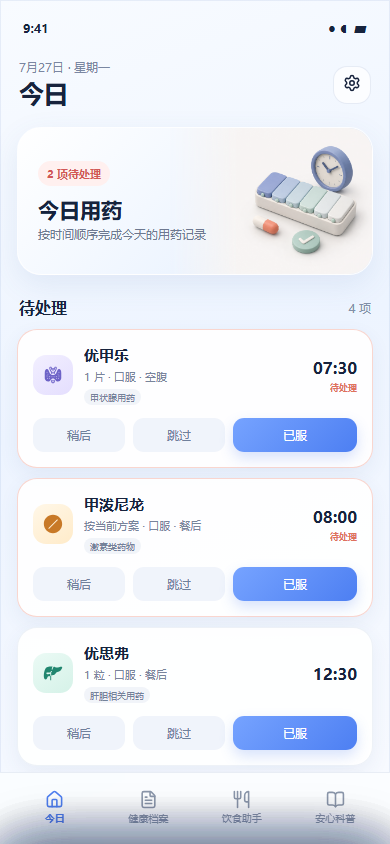
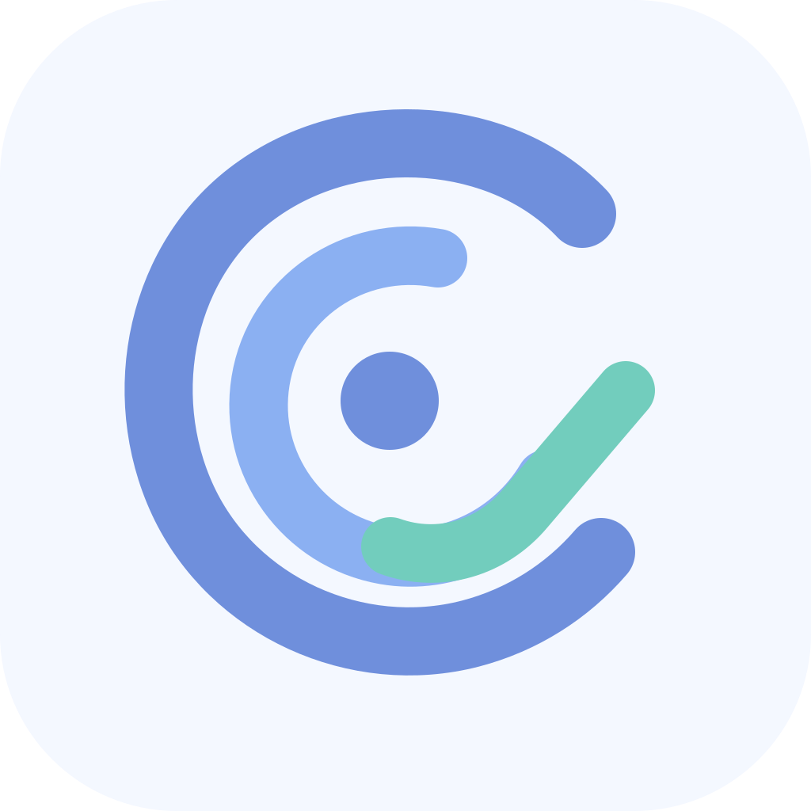

# Healther · 本地健康助手

一个为慢性病长期管理场景设计的本地优先健康助手原型。目前聚焦四件事：

- 按时间完成和记录每日用药；
- 在复诊前生成一份可直接给医生查看的近期摘要；
- 在就诊后整理病历、检查、用药变化和下一次复查；
- 提供克制的饮食筛选与权威患者科普入口。

当前版本是可点击的 Web 原型，目标设备为 OPPO 安卓手机。后续计划在完成真实场景验证后，封装为可安装的安卓应用。

正式 React + Capacitor 安卓工程已经在 [`mobile-app/`](mobile-app/) 开始开发。当前第一里程碑是可靠用药提醒闭环，开发状态见 [`mobile-app/README.md`](mobile-app/README.md)。

正式工程现已包含可持久化的健康档案与“我的”：档案支持分类 Tab、二级详情、报告拍照/相册导入和本地归档；个人健康资料支持用户自定义并保存到 Android SQLite。

正式端五步“就诊后整理”已接入同一数据层：完成后同步生成就诊、用药变化和复查记录，并在 Android 上安排复查前一天和当天提醒。

“我的”现已支持生成和恢复带密码的本地加密备份包，用于换机迁移药物、健康档案、个人资料及报告图片。





## 当前功能

### 今日用药

- 所有药物按时间顺序完整展示；
- 支持“已服”“跳过”“稍后提醒”；
- 可以点击设置并修改具体药物的提醒时间、类别和备注；
- 可以修改复查日期、医院、医生和检查项目；
- 原型设置写入浏览器本地存储，刷新后继续保留；
- 已处理任务移动到页面底部；
- 跳过状态使用橙色标记；
- 通过颜色、图标和文字区分甲状腺、激素、肝胆和血糖相关药物。

### 健康档案

- 使用统一健康时间线组织就诊、检查、用药调整和复查计划；
- “就诊后整理”采用 5 步引导录入：就诊信息、医生意见、诊断变化、用药变化和复查计划；
- 支持拍照或从相册选择报告，并补充日期、类型、医院科室和备注；
- 报告在本机生成缩略图，按报告日期倒序归档，并回到健康时间线；
- 时间线支持按就诊、检查、用药和复查筛选；
- 点击就诊、检查、用药或复查记录，可进入二级详情查看当次整理内容和原始报告；
- 手工录入的指标与原始报告保持可核对关系。

### 我的

- 管理基础疾病、手术史、常用医院与医生；
- 管理当前治疗、用药方案和提醒；
- 集中放置本地备份、换机恢复、字体、通知权限和隐私说明；
- 不重复存放就诊记录和报告，相关入口仍统一归入健康档案。

### 五分钟复诊准备

复诊前一天依次确认：

1. 最近身体变化；
2. 用药完成和调整情况；
3. 值得告诉医生的异常；
4. 检查资料是否齐全；
5. 本次最想询问医生的问题。

系统记录和本人回忆在正式摘要中应明确区分。

### 饮食助手

- 面向开饭前的食物选择；
- 展示每 100 克热量、碳水、蛋白质、脂肪和膳食纤维；
- 使用“更适合 / 注意份量 / 谨慎选择”的保守分级；
- 解释食物与不同健康状况的关联；
- 不提供个体化治疗方案，也不根据化验结果自动推荐。

### 安心科普

- 不提供开放式疾病搜索和无限资讯流；
- 只计划采用权威机构发布的患者科普；
- 外文内容需要翻译并保留原始来源；
- 重点回答“这对现在意味着什么”和“下次可以问医生什么”。

## 本地运行

项目没有第三方运行依赖，可以直接打开 `index.html`。

推荐通过本地 HTTP 服务运行：

```powershell
cd "E:\OneDrive\文档\mum"
python -m http.server 4173 --bind 127.0.0.1
```

然后访问：

```text
http://127.0.0.1:4173/
```

## 项目结构

```text
.
├─ assets/
│  └─ illustrations/       # 项目专用插画
├─ reference/              # 前期视觉参考图，不参与页面运行
├─ app.js                  # 原型数据和交互
├─ index.html              # 页面结构
├─ styles.css              # 视觉系统和响应式布局
├─ DESIGN.md               # 信息架构与设计决策
└─ README.md
```

## 产品边界

Healther 当前是健康记录与提醒工具，不是医疗诊断或用药审核系统。

- 用户自行设置提醒时间、剂量和频次；
- 原型不判断用药调整是否正确；
- 饮食内容仅为保守的通用筛选；
- 科普内容不能替代医生意见；
- 当前演示数据和医学文案不能直接用于真实治疗决策。

正式发布前，饮食规则、疾病科普、风险提示和药物相关文案必须经过权威资料核验，并建议由合格的临床或营养专业人员审核。

## 数据与隐私

首版产品方向为：

- 无需注册；
- 数据仅保存在本机；
- 不默认上传云端；
- 提供主动导出全部资料的能力。

当前 Web 原型尚未实现正式的本地数据库、文件加密、数据导出或安卓系统通知。

## 后续路线

1. 使用真实复诊场景验证核心流程；
2. 完成就诊后整理和复诊摘要的高保真页面；
3. 建立经核验的饮食筛选规则和权威科普来源清单；
4. 实现本地数据库、照片存储与资料导出；
5. 适配 OPPO 通知权限和后台限制；
6. 首个 Android 调试安装包已构建完成，下一步进行 OPPO 真机测试并制作正式签名版本。

详细设计见 [DESIGN.md](DESIGN.md)，数据来源与文章收录规则见 [DATA_SOURCES.md](DATA_SOURCES.md)。

## 视觉资产

当前三张主插画使用 OpenAI 内置图像生成能力为本项目生成：

- `medication-hero-v2.png`
- `food-guide-v2.png`
- `learning-path-v2.png`

当前视觉采用现代极简 2.5D 风格：无人像、低饱和、哑光几何体和大面积留白。旧版插画保留在资产目录中作为设计回退。

界面已经实际引入以下第三方开源 SVG，并在对应目录保留许可证：

- [Health Icons](https://github.com/resolvetosavelives/healthicons)（CC0）
- [Lucide](https://github.com/lucide-icons/lucide)（ISC）
