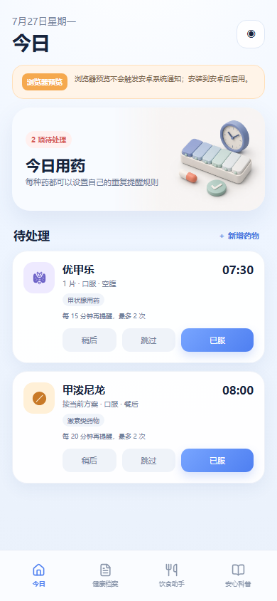
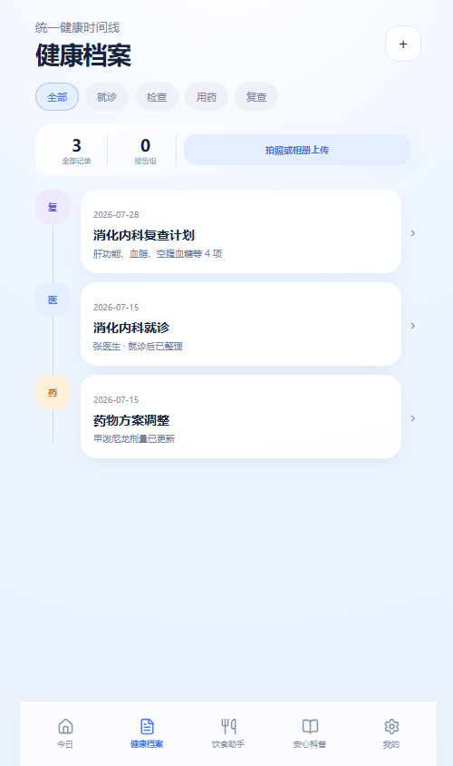
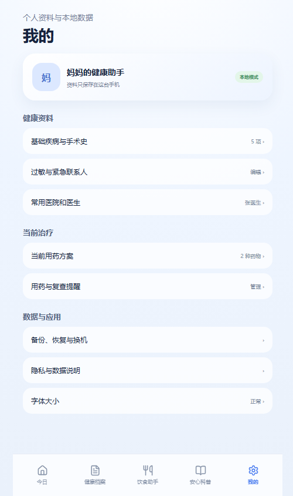

# Healther Mobile



Healther 的正式 React + Capacitor 安卓工程。根目录的静态页面继续作为设计原型，本目录用于真实功能开发。

## 第一里程碑

当前已经实现可靠用药提醒、健康档案和个人资料管理。用药闭环为：

```text
新增或编辑药物
    ↓
设置时间、重复间隔、次数和稍后时长
    ↓
保存到本地数据库
    ↓
安排未来 14 天安卓本地通知
    ↓
已服 / 跳过 / 稍后
    ↓
记录用药事件
```

健康档案支持就诊、检查、用药和复查分类 Tab；新增记录后按业务日期排序，点击时间线卡片进入二级详情。检查报告可以直接拍照或从相册选择，压缩后保存在本机并支持查看原图。

正式端“就诊后整理”使用五步引导填写就诊信息、医生意见、诊断变化、用药变化与复查计划。完成后会生成关联的就诊、用药变化和复查记录；复查在 Android 上安排前一天 19:00 和当天 07:30 两次本地提醒。记录的用药变化不会自动修改服药方案，需要用户再次核对确认。

整理过程中每次修改都会自动保存草稿；退出或被系统中断后重新进入，会恢复上次内容。每一步必须明确填写，或者选择“没有变化 / 医生未安排 / 记不清”，避免生成内容空白但看似完整的就诊记录。

“我的”支持自定义基础疾病、手术史、过敏史、常用医院、医生和紧急联系人。

| 健康档案 | 我的 |
| --- | --- |
|  |  |

## 已实现

- React + TypeScript + Vite 正式工程；
- Capacitor Android 原生工程；
- 浏览器预览使用本地存储；
- Android 使用 SQLite；
- 药物与用药事件数据模型；
- 每种药单独设置：
  - 首次提醒时间；
  - 重复间隔；
  - 最大重复次数；
  - 默认稍后时长；
  - 类别、剂量、备注和启用状态；
- 通知操作：已服、跳过、稍后；
- 未来 14 天滚动通知窗口；
- 点击已服或跳过时仅取消当天剩余提醒，不删除未来日期；
- 稍后会重新安排当天的提醒序列；
- Android 通知频道、通知权限、精确闹钟设置检查；
- 重启恢复由 Capacitor Local Notifications 插件接收系统启动事件；
- 禁止 Android 系统自动云备份本地健康数据库。
- 健康档案分类筛选、时间线与记录详情；
- 就诊、检查报告、用药调整和复查记录的新增与删除；
- 报告拍照、相册多选、本地压缩和原图查看；
- “我的”健康资料编辑与本地持久化。

## 数据存储

### Android

使用 `@capacitor-community/sqlite`：

- `medications`：保存药物方案 JSON；
- `medication_events`：保存每天的处理结果。
- `health_records`：保存就诊、报告、用药调整、复查及报告图片；
- `user_profile`：保存用户自定义的基础疾病、手术史和常用就医资料。

### 浏览器

使用 `localStorage` 作为开发预览适配层。浏览器不会触发真实安卓系统通知。

## 通知可靠性

项目使用 `@capacitor/local-notifications`：

- Android 13+ 请求通知权限；
- Android 12+ 检查精确闹钟设置；
- `AndroidManifest.xml` 声明 `SCHEDULE_EXACT_ALARM`；
- 使用 `allowWhileIdle` 尽量在 Doze 状态下触发；
- 插件负责接收设备重启广播并恢复本地通知。

OPPO 真机仍需单独验证：

- 通知权限；
- 精确闹钟权限；
- 后台运行和电池优化；
- 自启动或关联启动设置；
- 重启后恢复；
- 锁屏通知操作。

## 本地开发

```powershell
cd "E:\OneDrive\文档\mum\mobile-app"
pnpm install
pnpm run typecheck
pnpm run build
pnpm run dev
```

浏览器预览：

```text
http://127.0.0.1:3001/
```

同步 Android：

```powershell
pnpm run build
npx cap sync android
```

## APK 构建环境

当前机器尚未安装 JDK 和 Android SDK，因此还不能运行 Gradle 生成 APK。需要：

- JDK 21；
- Android SDK；
- Android SDK Platform 36；
- Android Build Tools；
- 正确设置 `JAVA_HOME` 和 `ANDROID_HOME`。

环境完成后：

```powershell
cd "E:\OneDrive\文档\mum\mobile-app\android"
.\gradlew.bat assembleDebug
```

调试 APK 默认生成在：

```text
android\app\build\outputs\apk\debug\app-debug.apk
```

## 下一步

1. 安装 Android 构建环境并生成首个 APK；
2. OPPO 真机验证通知权限和重复提醒；
3. 增加滚动窗口续排机制；
4. 完善日期、停药和多时段服药；
5. 开发健康档案和报告图片存储；
6. 接入公共食物数据及权威科普内容后台。
